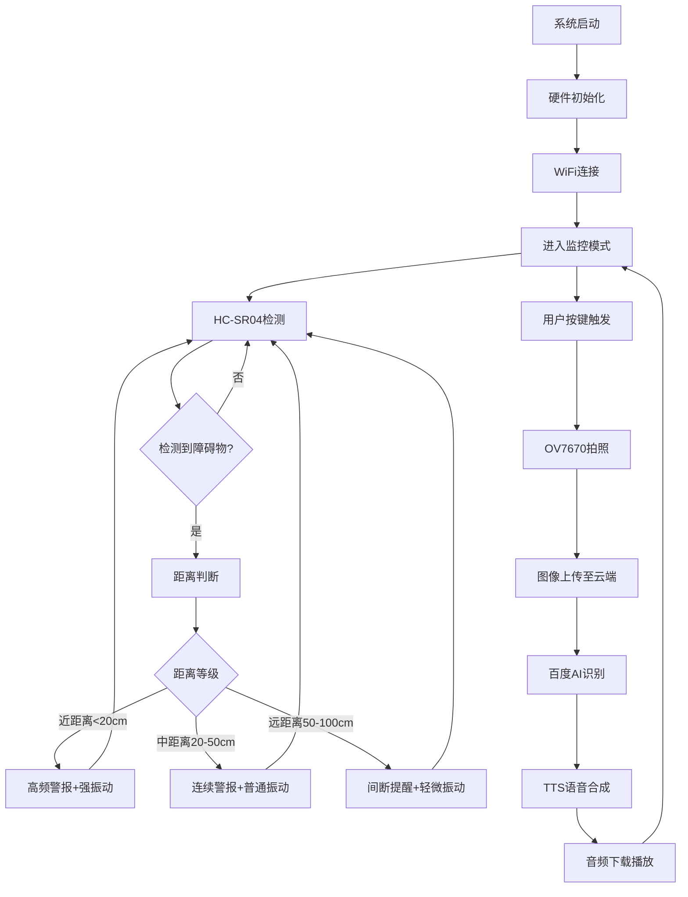

# 🦯 STM32F407盲人辅助系统 <sub>基于嵌入式技术的无障碍解决方案</sub>

<div align="center">


</div>

## 📋 项目概述

本项目为本人制作了两个多月的毕业设计，目的是为了探究特殊群体的无障碍需求，因此该项目是以科学探究为主，而不是为了做消费级产品，也就是说成品效果只能说是能用但不好用，或者换句话说该项目更多像是概念型产品，旨在为之后的盲人无障碍辅助系统研究提供一个方向。

---

## 🚀 傻瓜式教你如何部署

### 📋 环境要求

**需要购买的硬件:**
- STM32F407ZGT6开发板
- HC-SR04
- ESP8266
- OV7670(无FIFO)
- MAX98357
- ST7789(SPI)
- XL6009 DC-DC可调升压模块
- TP4056充电模块
- 103450锂电池
- ST-LINK V2
- 有源蜂鸣器
- 振动马达
- SD卡
- 按钮
- 面包板

**软件环境:**
- STM32CubeMX (最新版本)
- Keil MDK-ARM V5.32+
- HAL库支持

### ⚡ 编译部署

1. **下载项目**

2. **STM32CubeMX配置**
   - 此步骤可以省略
   - 如需要配置STM32CubeMX，可直接打开STM32F407-Accessibility-Assistance-System.ioc进行配置

3. **需要修改的地方**

**打开mqtt.h文件并定位到以下位置修改MQTT服务器配置信息** (ESP8266与MQTT服务器进行连接通信)

```c
#define MQTT_BROKER ""    // 请在引号之间输入MQTT服务器地址
#define MQTT_PORT 1883    // 标准MQTT端口，若需要使用SSL加密连接则修改为8883
#define MQTT_CLIENT_ID "" // 请在引号之间输入客户端ID
#define MQTT_USERNAME ""  // 请在引号之间输入用户名，可以不填
#define MQTT_PASSWORD ""  // 请在引号之间输入密码，可以不填
```

**打开esp8266.h文件并定位到以下位置修改WiFi连接配置** (ESP8266连接到你的WIFI)

```c
#define WIFI_SSID ""     // 请在引号之间输入WiFi名称
#define WIFI_PASSWORD "" // 请在引号之间输入WiFi密码
```

**打开STM32F407-Accessibility-Assistance-System.py文件并定位到以下位置修改API密钥配置** (用于百度AI图片识别)

```python
self.api_key = tk.StringVar(value="")     # 请在引号之间输入百度AI提供的api_key
self.secret_key = tk.StringVar(value="")  # 请在引号之间输入百度AI提供的secret_key
self.mqtt_broker = tk.StringVar(value="") # 请在引号之间输入MQTT服务器地址
```

4. **编译烧录**
   - 使用Keil MDK打开项目或者直接打开STM32F407-Accessibility-Assistance-System.uvprojx
   - 连接ST-Link调试器
   - 按F7编译
   - 按F8下载到STM32板

---

## ⚙️ 硬件连接

### ESP8266 WiFi模块
| ESP8266引脚 | STM32引脚 | 功能描述 |
|------------|-----------|----------|
| TX | PA10 | 串口通信(ESP→STM32) |
| RX | PA9 | 串口通信(STM32→ESP) |
| GND | GND | 共地 |
| 3V | 3.3V | 电源供电 |
| EN | 3.3V | 使能信号 |
| RST | PC14 | 复位控制 |

### ST7789 TFT显示屏
| ST7789引脚 | STM32引脚 | 功能描述 |
|-----------|-----------|----------|
| SCL | PF0 | SPI时钟信号 |
| SDA | PF1 | SPI数据信号 |
| DC | PF3 | 数据/命令控制 |
| RES | PF2 | 复位控制 |
| BLK | PF5 | 背光控制 |
| CS | PF4 | SPI片选信号 |

### HC-SR04 超声波传感器
| 传感器 | TRIG引脚 | ECHO引脚 | 功能 |
|--------|----------|----------|------|
| HC-SR04 #1 | PD13 | PD12 | 前方障碍物检测 |
| HC-SR04 #2 | PD11 | PD10 | 侧面障碍物检测 |

### OV7670 摄像头模块
| OV7670引脚 | STM32引脚 | 功能描述 |
|-----------|-----------|----------|
| SCL | PF7 | I2C时钟线(SCCB) |
| SDA | PF6 | I2C数据线(SCCB) |
| VS | PB7 | 垂直同步信号 |
| HS | PA4 | 水平同步信号 |
| PCLK | PA6 | 像素时钟 |
| MCLK | PA8 | 主时钟输入 |
| RST | PG8 | 复位控制 |
| PWDN | PG6 | 电源管理 |
| D0-D7 | PC6,PC7,PE0,PE1,PE4,PB6,PE5,PE6 | 8位数据总线 |

### MAX98357A 音频放大器
| MAX98357A引脚 | STM32引脚 | 功能描述 |
|--------------|-----------|----------|
| BCLK | PB3 | I2S位时钟 |
| LRC | PA15 | I2S左右声道时钟 |
| DIN | PB5 | I2S数据输入 |

### 反馈组件
| 组件 | STM32引脚 | 功能描述 |
|------|-----------|----------|
| 振动马达 #1 | PD1 | 主要触觉反馈 |
| 振动马达 #2 | PD0 | 辅助触觉反馈 |
| 蜂鸣器 | PD2 | 声音警报 |

---

## 🛠️ 系统工作流程


---

## 🛣️ 开发路线

### ✅ 已完成功能
- [x] STM32硬件驱动开发
- [x] HC-SR04障碍物检测
- [x] OV7670摄像头拍照功能
- [x] ESP8266WiFi连接
- [x] MQTT协议数据传输
- [x] 百度AI图像识别API对接
- [x] TTS语音合成系统
- [x] SD卡文件管理系统以及图像保存
- [x] 用户交互界面

### ❌ 未解决的问题
- [ ] MAX98357未实现
- [ ] 蜂鸣器会长鸣
- [ ] HC-SR04检测会阻塞

### 🔄 未来想法但也许不会再继续开发了
- [ ] GPS定位导航功能
- [ ] 语音控制系统
- [ ] 手机APP远程监控
- [ ] 音频模块播报语言

### ⚠️ 目前存在的问题
1. **网络依赖**: 图像识别功能需要稳定WiFi连接
2. **光照敏感**: OV7670在弱光环境下成像质量下降
3. **服务器负载**: 公共MQTT服务器在高峰期不稳定

---

## 🙏 致谢

感谢以下开源项目和技术支持：

### 核心技术栈
- [STM32 HAL Library](https://github.com/STMicroelectronics/STM32CubeF4) - STM32官方HAL库
- [ESP8266 Arduino Core](https://github.com/esp8266/Arduino) - ESP8266开发框架
- [Eclipse Paho MQTT](https://www.eclipse.org/paho/) - MQTT通信协议
- [百度AI开放平台](https://ai.baidu.com/) - 图像识别

---

<div align="center">

### 🌟 项目愿景

**让科技成为连接不同能力人群的桥梁**

*"Technology should serve humanity, humanity includes everyone."*

---

**⭐ 如果这个项目对你有帮助，请给个Star支持一下！**

**🔗 让更多人了解无障碍技术的重要性**

[](https://star-history.com/#ZUlxian/STM32F407-Accessibility-System&Date)

---

**📧 作者**: [ZU_xian]

</div>
